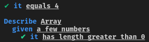

# 45

> A functionally-oriented test runner

`45` is the fast and functional test runner that is easy to use and gets out of
your way.

## Let me have it!
```sh
npm install --save-dev 45
```

## Features

- Does not rely on globals
- Test failure if no assertions are returned
- Lazy, monadic, and curried test assertions via [`4.5`](https://github.com/TylorS/4.5)
- Promise, Observable, and Async/Await support
- Runs all tests in parallel
- ES2015 and TypeScript support out-of-box

## Basic Usage

Create a test file

```js
// test/foo.js

// ES2015
import { describe, given, it, equals } from '45';

export const test = describe('Array', [
  given('a few numbers', [
    it('has length greater than 0', () => {
      return equals([1, 2, 3].length > 0, true);
    })
  ])
])

export const otherTest = it('equals 4', () => {
  return equals(4, 4);
})

// commonjs
const { describe, given, it, equals } = require('45');

exports.test = describe('Array', [
  given('a few numbers', [
    it('has length greater than 0', () => {
      return equals([1, 2, 3].length > 0, true);
    })
  ])
])

exports.otherTest = it('equals 4', () => {
  return equals(4, 4);
})
```

In your terminal run

```sh
./node_modules/.bin/45 test/foo.js
# Supports globs
./node_modules/.bin/45 test/*.js

# or without parameters
# by default it will search for all .test and .spec files in src/ folder
# and for all files in test/ and tests/ folders
./node_modules/.bin/45
```

And you should see:



## Tests

When running 45 from the command line, it will look for all test files
it can, collecting all exports, of no particular export name, that adhere
to the `Test` interface described in the [types](#types) section. This means
that 45 can be extended to handle new test types not offered here via 3rd
party libraries.

All 45 `Test`s must return objects adhering to the `Assertion` interface
described in the [Types](#types) section. Many assertions are re-exported by this
library from [4.5](https://github.com/TylorS/4.5). Though a number are provided
by default -- 3rd party libraries implementing the `Assertion` interface can be used
100% freely.

#### `describe(thing: string, tests: Array<Test>): Test`

Allows collecting many `Test`s together as a larger whole. All tests are
run in parallel.

```typescript
import { describe } from '45';

export const test = describe('My Thing', [ ... ])
```

#### `given(parameters: string, tests: Array<Test>): Test`

Just like `describe` in that it allows collecting many `Test`s together as a
larger whole, but allows for more descriptive test suites. All tests are run in
parallel.

```typescript
import { describe, given } from '45';

export const test = describe('My thing', [
  given(`a b and c`, [
    it('does ...', () => { ... })
  ])
])
```

#### `it(does: string, testFn: TestFn): Test`

Primitive test type which allows providing a callback to
actually perform assertions.

```typescript
import { it, pass } from '45';

export const test = it('does things', () => {
  return pass(1);
})
```

## Assertions (re-exported from 4.5)

- All functions of arity 2 or more are curried.
- All types are defined below in the [types](#types) section.

#### `equals<A>(expected: A, actual: A): Assertion<A>`

Asserts two values `expected` and `actual` to have value equality.

#### `is<A>(expected: A, actual: A): Assertion<A>`

Asserts two values `expected` and `actual` to have referential equality.

#### `pass<A>(value: A): Assertion<A>`

Creates an assertion which always passes with a given value.

#### `fail(message: any): Assertion<void>`

Creates an assertion which will always fail with a given message.

#### `throws(fn: () => any): Assertion<Error>`

Creates an assertion that tests that a given function throws and error.

## Assertion combinators (re-exported from 4.5)

#### `map<A, B>(fn: (a: A) => B, assertion: Assertion<A>): Assertion<B>`

Given a function it maps one assertion value to another.

```typescript
import { it, map, equals } from '45';

export const test = it('maps a value from type A to type B', () => {
  const add1 = (x: number) => x + 1;

  return map(add1 /* called with 1 */, equals(1, 1)) // Assertion<2>;
});
```

#### `ap<A, B>(fn: Assertion<(a: A) => B>, value: Assertion<A>): Assertion<B>`

Given an assertion containing a function from `a` to `b`, and an assertion
of `a` returns an assertion of type `b`.

```typescript
import { it, ap, pass } from '45';

export const test = it('applys fn to a value', () => {
  const add1 = (x: number) => x + 1;

  const fn: Assertion<(x: number) => number> = pass(add1);
  const value: Assertion<number> = pass(1);

  return ap(fn, value); // returns an assertion containing the value 2
});
```

#### `chain<A, B>(fn: (a: A) => Assertion<B>, assertion: Assertion<A>): Assertion<B>`

Given a function from one value a to Assertion b and an assertion of type a, returns an assertion of type b
Useful for making many assertions using the values from the previous assertion.

```typescript
import { it, chain, equals, map }

export const test = it('chains many assertions', () => {
  const add1 = (x: number) => x + 1;

  const oneIsOne = equals(1, 1);
  const isTwo = equals(2); // don't forget, all assertions are curried!
  const isThree = equals(3);

  return chain(isThree, map(add1, chain(isTwo, map(add1, oneIsOne))));
})
```

#### `bimap`

Type signature is to long for the header :smile:

```typescript
bimap<A, B>(
  failure: (message: string) => string,
  success: (a: A) => B,
  assertion: Assertion<A>): Assertion<B>;
```

Similar to `map` but also allows adjusting error messages.

Useful for creating your own error messages.

```typescript
import { bimap, equals, fail, pass } from '45';

export const test = it('allows adjusting error message', () => {
  return bimap(() => 'Sadly 1 is not correct', fail /* should not pass*/, fail(1));
});
```

#### `concat(one: Assertion<A>, two: Assertion<A>): Assertion<A>`

Chain together 2 assertions.

```typescript
import { concat, pass, it } from '45';

export const test = it('concatenates', () => {
  return concat(pass(1), pass(2)); // passes if and only if both assertions pass.
});
```

## Types

```typescript
// 45 interfaces
export interface Test {
  name: string;
  timeout: number;
  run(): Promise<Assertion<any>>;
  showStatus: boolean;
}

export type TestFn =
  (() => Assertion<any>) |
  (() => Promise<Assertion<any>>) |
  (() => Observable<Assertion<any>>);

export interface TestResult {
  failures: number;
  message: string;
}

export type Observable<A> =
  {
    subscribe(observer: Observer<A>): Subscription;
  }

export type Observer<A> =
  {
    next(value: A): any;
    error(err: any): any;
    complete(): any;
  }

export type Subscription =
  {
    unsubscribe(): any;
  }

// 4.5 re-exported interfaces

export interface Assertion<T> {
  verify(verification: Verification<T>): void;
}

export interface Verification<T> {
  success(actual: T): any;
  failure(message: string): any;
}
```